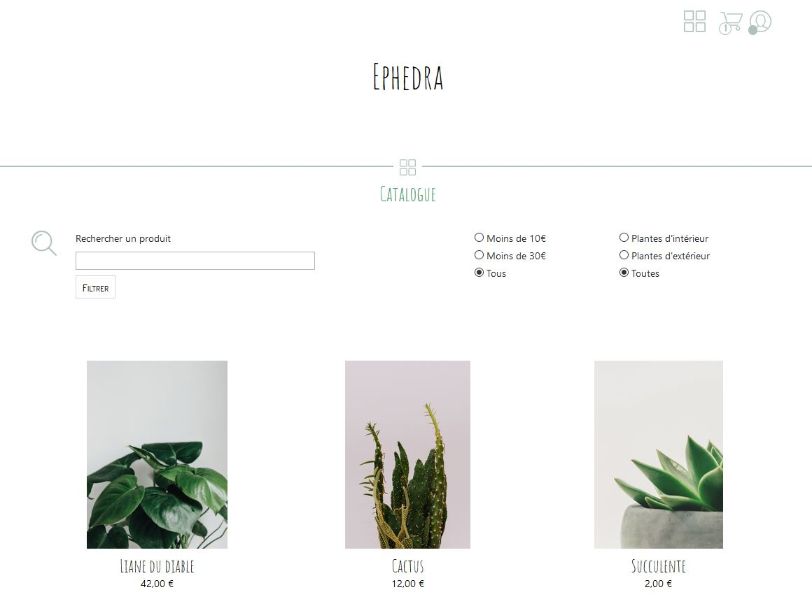
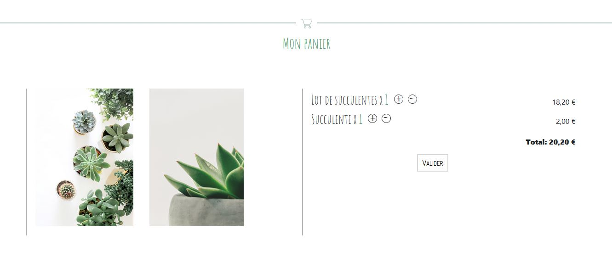

# Ephedra

Réalisation d'un site e-commerce en PHP et JavaScript.

## Technologies

Le front-end est réalisé en utilisant Bootstrap, ainsi que des templates Twig.
Quant au back-end, il utilise l'ORM Doctrine ainsi que le framework PHP Slim.

## Pages et fonctionnalités

### `/` ou `index.php`
Page d'accueil du site, notamment accessible en cliquant dans le header, sur le nom du site.

Les produits sont triés en fonction du nombre de commandes les contenant (le plus acheté figure en premier).

### `/catalogue`
Catalogue listant les différents produits, avec pagination.
Il est possible de combiner la recherche par mots-clefs avec les filtres.

### `/panier`
Panier d'un utilisateur. Il est possible d'y modifier les quantités de chaque article
(aller jusqu'à 0 supprime le produit du panier). Valider la commande l'enregistre en base de données si l'utilisateur
est connecté, sinon, il sera redirigé vers la page de connexion.

### `/compte`
Il est possible d'y consulter les informations de l'utilisateur/client connecté.
Cette page n'est donc pas accessible par un utilisateur déconnecté.

Cliquer sur le bouton "modifier" fait apparaître un formulaire de modification avec une validation JavaScript.
Le seul champ qu'il n'est pas obligatoire de remplir est celui du nouveau de mot de passe, si l'utilisateur ne souhaite
pas le modifier.

Le nombre de commandes réalisées y figure ; en fonction du temps passé depuis chaque commande,
elle est comptabilisée comme étant "en cours de traitement" ou "réceptionnée".

C'est également l'endroit où il est possible de se déconnecter.

### `/produit/id-produit`
Page présentant un produit, accessible en cliquant dans le catalogue ou dans la page d'accueil.
C'est ici qu'un produit peut être ajouté au panier.

### `/connexion`
Cette page permet de se connecter ou de s'inscrire (après avoir cliqué sur le bouton "afficher le formulaire d'inscription").
Les deux formulaires sont validés en JavaScript (le formulaire de connexion ne vérifie que le remplissage des champs,
tandis que celui d'inscription guide l'utilisateur).

Cette page n'est pas accessible par un utilisateur connecté.

### Général

Toute autre URL mène à la page 404.

Afin de garder un menu minimaliste, la même icône est utilisée pour se connecter et pour accéder
à son compte client. En effet, la première page n'est accessible qu'à un utilisateur déconnecté,
alors que la deuxième ne l'est que pour un utilisateur connecté.

Le menu indique à la fois si l'utilisateur est connecté, et le nombre d'articles présents dans le panier de l'internaute.

##  Sécurité (injections SQL)

D'après la documentation, parmi les méthodes de Doctrine, seul le `QueryBuilder` n'est pas sécurisé vis-à-vis des entrées utilisateur.
En revanche, la fonction `setParameter` l'est. Cette application est donc sécurisée en ce qui concerne les injections SQL.

Source : https://www.doctrine-project.org/projects/doctrine-orm/en/latest/reference/security.html#user-input-and-doctrine-orm